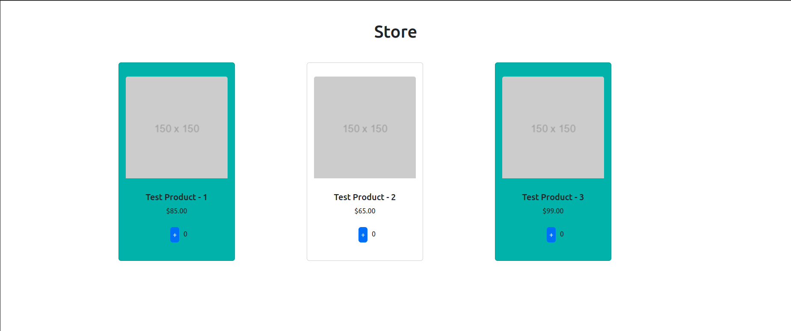

## Exercises 6 - Using Bootstrap with Angular, Template Driven Forms

You can find implementation from exercises in the directory `Exercises 6/ecommerce` and `Exercises 6/template-driven-forms-example`.
Setup instructions for installing bootstrap in angular can be found in the file `Exercises 6/setup_bootstrap.md`.

In this exercises first we continued working on ecommerce website from last exercises and demonstrated the use of bootstrap with angular (using bootstrap components in angular templates). After that we implemented a simple template driven form for adding new products to the website using ngModel directive.

### Ecommerce with Bootstrap

This project is a continuation of ecommerce website from last exercises. No new functionality was added, but the website was styled using bootstrap. On the image below you can see the final look of the page styled with bootstrap.

### Template Driven Forms

In this project we build very simple example of template driven form to demonstrate use of ngModel directive with 1-way and 2-way data binding.

- Create class `Product` with properties `name`, `imageUrl`, `price` and `type` (product can be new, used or not used).

- Create new component create-product with template containing form for creating new product. Form should contain inputs for all properties of the product class. Set name field to be required.

- Add commit and reset buttons to the form. Commit button should be disabled if the checkbox for accepting terms is not checked. 

- Use ngModel directive to bind inputs to properties of the product class. Use 1-way and 2-way data binding. Product name should always be displayed in uppercase.

- Use state of form css classes to color inputs in green if they are valid and red if they are invalid. Let first user to change the value of the inputs and then display red color if the input is invalid.

### How to run angular projects?

1. Clone this repository to your local machine.
2. Make sure you followed all the instructions in `Exercises 4/angular_setup.md` to setup nvm, npm, node and angular cli.
3. Open terminal and navigate to the root directory of angular project (e.g. `Exercises 4/stock-market`).
4. Run `npm install` to install all dependencies.
5. If you encounter any vulnerabilities, run `npm audit fix` to fix them.
6. Run `ng serve` to start the server.

